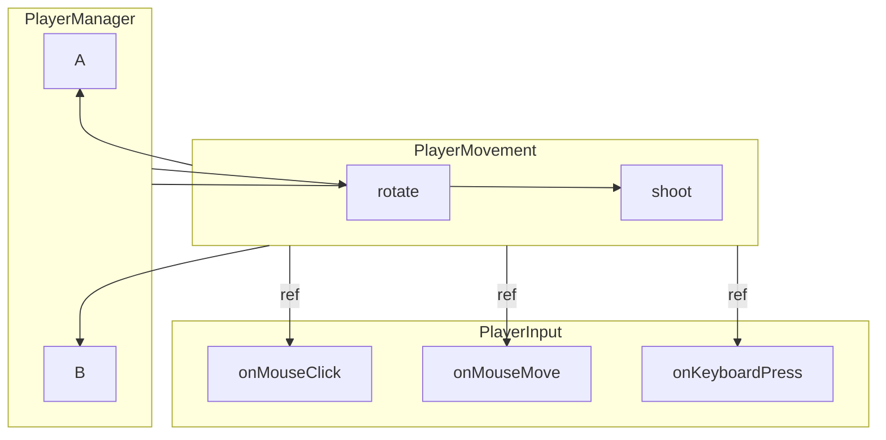
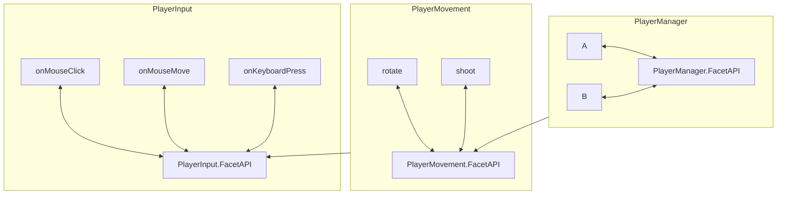

# Facet API

Facet API is a simple plug-and-pull library for managing your callbacks in C# to avoid annoying external references to other classes or objects.

## Design

This API is designed mostly for Unity, but I guess it can be used in other C# projects as well.

The main idea is to have a unified interface of access between classes that has functions that needs to be called on either side. For example:



As you can see from the graph, classes are accessing classes to try to access the different functions or variables within them, leading to
a spaghetti of references and are sometimes hard to manage and track down.

With FacetAPI, you can unify all the functions and variables you need to access into callbacks:



As you can see, the classes are now only accessing the FacetAPI of the other classes, which is a single point of access to all the functions and variables you need to access. This makes it easier to manage and track down references between classes.
This also allows you to easily swap out implementations of the FacetAPI without having to change the references in the other classes. This is especially useful for testing, as you can easily swap out the implementation of the FacetAPI with a mock implementation for testing purposes.

## Usage
The usage itself is pretty simple, per design. Though we are using a name-based system, so you need to be careful with the names of the callbacks you create. (We have error handling for conflicting names, but it is still a good idea to be careful with the names you use.)

What we'd suggest for a workaround of the issue above is to have a class have all the static constant variables of the keywords of callbacks, that way when getting callbacks or creating callbacks you'd have better control over the names you use.

### Creating a Callback

```csharp
// Create API instance
var api = new FacetApi();

// Create a callback
var callback = api.CreateCallback<Action<string>>("testCallback");

// Subscribe
callback.Subscribe(msg => Console.WriteLine($"Received: {msg}"));

// Invoke
callback.Invoke("Hello World");

// Watch for condition (async version)
var cts = new CancellationTokenSource();
_ = callback.WatchAndInvokeAsync(
    "Test", 
    () => DateTime.Now.Second % 10 == 0, 
    TimeSpan.FromSeconds(1),
    cts.Token);
```

### Getting a Callback

```csharp
// Create and register a callback
var api = new FacetApi();
api.CreateCallback<Action<int>>("onScoreChanged");

// Later, fetch it elsewhere in your code
var scoreCallback = api.Get<Action<int>>("onScoreChanged");
scoreCallback.Subscribe(score => Console.WriteLine($"Score changed to {score}"));

// Invoke it
scoreCallback.Invoke(100);
```

## Installation

### NuGet

Pending

### Unity

1. Open the Unity Package Manager.
2. Click the "+" button and select "Add package from git URL...".
3. Enter the URL of this repository.
4. Click "Add".
5. Wait for Unity to download and import the package.
6. Use the package in your scripts.